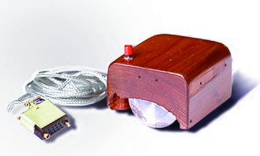

# 

> ### Elixir + Phoenix + GraphQL + React + TypeScript codebase containing real world examples (CRUD, auth, advanced patterns, etc) that adheres to the [RealWorld](https://github.com/gothinkster/realworld) spec and API.

### [Demo](https://github.com/gothinkster/realworld)&nbsp;&nbsp;&nbsp;&nbsp;[RealWorld](https://github.com/gothinkster/realworld)

This codebase was created to demonstrate a fully fledged fullstack application built with **[Elixir + Phoenix + GraphQL + React + TypeScript]** including CRUD operations, authentication, routing, pagination, and more.

I've gone to great lengths to adhere to the Elixir and Javascript communities styleguides & best practices.

For more information on how to this works with other frontends/backends, head over to the [RealWorld](https://github.com/gothinkster/realworld) repo.

# How it works

> This application uses Phoenix framework with the GraphQL server and PostgreSQL database for the back-end and React with TypeScript driving by "create-react-app" tool for the front-end.

# Getting started

To run this project, you will need to install the following dependencies on your system:

- [Elixir](https://elixir-lang.org/install.html)
- [Phoenix](https://hexdocs.pm/phoenix/installation.html)
- [PostgreSQL](https://www.postgresql.org/download/)
- [NodeJS](https://nodejs.org/en/download/)
- [yarn](https://yarnpkg.com/lang/en/docs/install/)

To get started, run the following commands in your project folder:

```shell
mix deps.get  # installs the backend dependencies
cd ./assets && yarn install && cd .. # installs the frontend dependencies and setup the build
mix ecto.create  # creates the database.
mix phx.server  # run the application.
```

## Contribution guide, other frontend and backend examples

- [Starter guide and spec](https://github.com/gothinkster/realworld/tree/master/spec)
- [Starter kit](https://github.com/gothinkster/realworld-starter-kit)
- [Elixir Phoenix backend example](https://github.com/gothinkster/elixir-phoenix-realworld-example-app)
- [React Redux frontend example](https://github.com/gothinkster/react-redux-realworld-example-app)
- [React MobX frontend example](https://github.com/gothinkster/react-mobx-realworld-example-app)

## Styleguides and code conventions

- [Elixir forum](https://elixirforum.com/c/phoenix-forum)
- [A community driven style guide for Elixir](https://github.com/christopheradams/elixir_style_guide)
- [Conventional Commits](https://www.conventionalcommits.org/en/v1.0.0/#summary)
- [Airbnb JavaScript Style Guide](https://github.com/airbnb/javascript)
- [🛁 Clean Code concepts adapted for JavaScript](https://github.com/ryanmcdermott/clean-code-javascript)

## Roadmap

1. research (docs, blogs, repos, google, communities, etc.)
2. create repo + configuration management (deps, configs, file restructuring)
3. modify backend code (configs, migrations, graph ql schemes, api, business logic implementation, testing, refactor)
4. modify frontend code (configs, creating components, business logic implementation, communication with backend, testing, refactor)
5. iter (point 1., etc.)

# Useful tips

- Autoformat on save for the vscode:
  You can use [this extension](https://marketplace.visualstudio.com/items?itemName=emeraldwalk.RunOnSave) for the vscode and then add the next parameters to the settings.json:

```shell
"emeraldwalk.runonsave": {
    "commands": [
      {
        "match": "\\.exs?$",
        "isAsync": false,
        "cmd": "cd ${workspaceRoot} && mix format ${file}"
      }
    ]
  },
```

<br />

# Inspired by "The Mother of All Demos"

["The Mother of All Demos"](https://en.wikipedia.org/wiki/The_Mother_of_All_Demos) is a name applied to a landmark computer demonstration that influenced both the Apple Macintosh and Microsoft Windows graphical user interface operating systems in the 1980s and 1990s.



<br />

# License

All of the codebases are **MIT licensed** unless otherwise specified.
